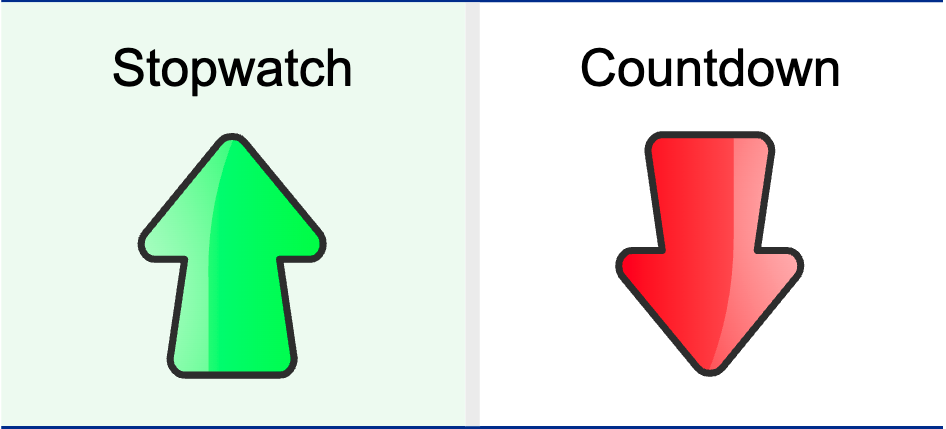

Primer prompt:

# Stopwatch
## Introducción
Como un experto en diseño de interfaces de usuario y en código Javascript necesito que me crees una aplicación web que funcione como cronometro y como cuenta atrás a partir de una entrada definida por el usuario

## Requisitos
- El código tiene que estar dividido en dos archivos: index.html y script.js
- El diseño de la pantalla debe ser como la imagen adjuntada. Si se hace click en el lado izquierdo se debe abrir el cronometro y si se da click en el lado derecho la cuenta atrás
- El código tiene que estar dividido en diferentes funciones y seguir buenas prácticas

Cuando tengas este primer paso realizado te daré más instrucciones