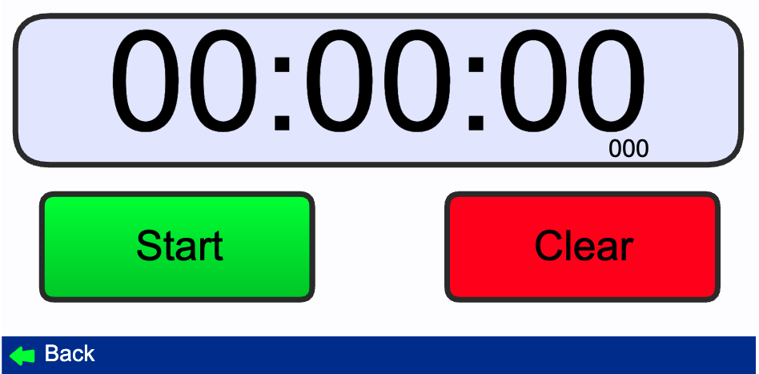

# Primer prompt:


```
# Stopwatch
## Introducción
Como un experto en diseño de interfaces de usuario y en código Javascript necesito que me crees una aplicación web que funcione como cronometro y como cuenta atrás a partir de una entrada definida por el usuario

## Requisitos
- El código tiene que estar dividido en dos archivos: index.html y script.js
- El diseño de la pantalla debe ser como la imagen adjuntada. Si se hace click en el lado izquierdo se debe abrir el cronometro y si se da click en el lado derecho la cuenta atrás
- El código tiene que estar dividido en diferentes funciones y seguir buenas prácticas

Cuando tengas este primer paso realizado te daré más instrucciones
```

# Segundo prompt:



```
Ahora vamos con la pantalla de cronómetro

# Cronómetro
## Introducción
Siguiendo con los archivos que ha me has generado necesito añadir la pantalla de cronometro. Esta pantalla va a contar con un contador grande junto con dos botones debajo que pongan Start y Clear. Además un footer que ponga back donde al hacer click te llevará a la pantalla principal.

## Requisitos
- El contador va a ir sumando horas minutos segundos y decimas de segundo
- El botón Start inicia el contador
- Cuando el contador está funcionando el botón Start cambia a Pause
- Si se le da al botón Pause el contador se pausa y el botón Pause pasa a ser Continue con un color azul
- El botón Clear para el cronometro y deja el contador a 0
- En el footer estará el botón back que te lleva a la pantalla principal
- El diseño debe ser como la imagen adjuntada
- El código tiene que estar dividido en diferentes funciones y seguir buenas prácticas
```

Fix segundo prompt:

```
Un cambio: necesito que el botón Pause sea del mismo color que Start
```